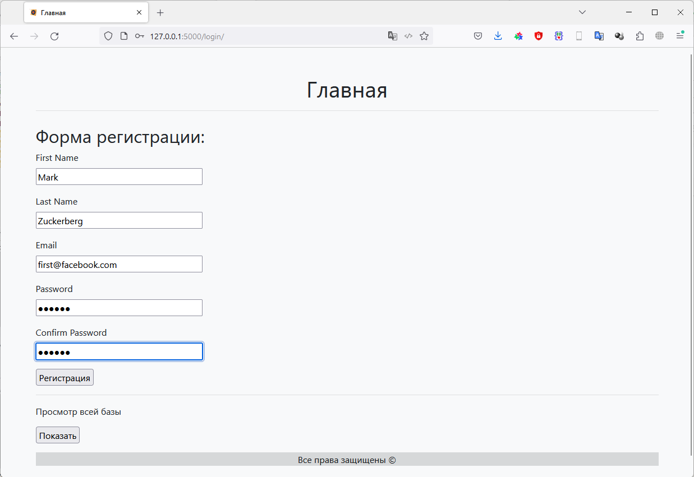
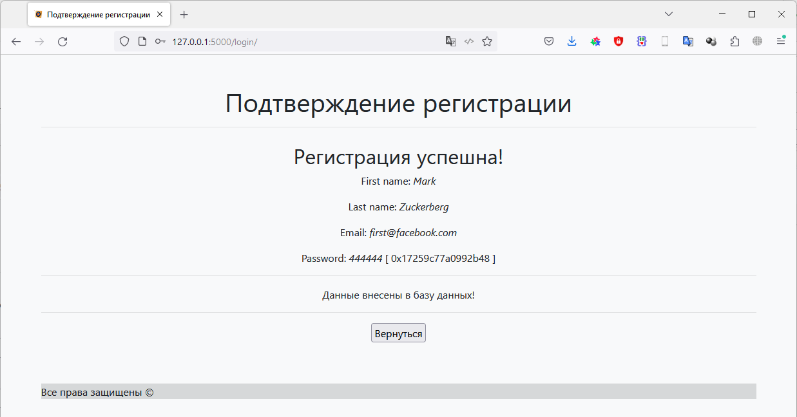

# Фреймворки Flask и FastAPI (семинары)
## Урок 2. Погружение во Flask

### Задание 1

Создать страницу, на которой будет форма для ввода имени и электронной почты, 
при отправке которой будет создан cookie-файл с данными пользователя, 
а также будет произведено перенаправление на страницу приветствия, 
где будет отображаться имя пользователя.
На странице приветствия должна быть кнопка «Выйти», при нажатии на которую будет удалён 
cookie-файл с данными пользователя и произведено перенаправление на страницу ввода имени и электронной почты.

### Решение
**Задание 1**

### Результат работы:

Результат находится в файле main.py

#### Главная страница

#### Страница "Подтверждение"

