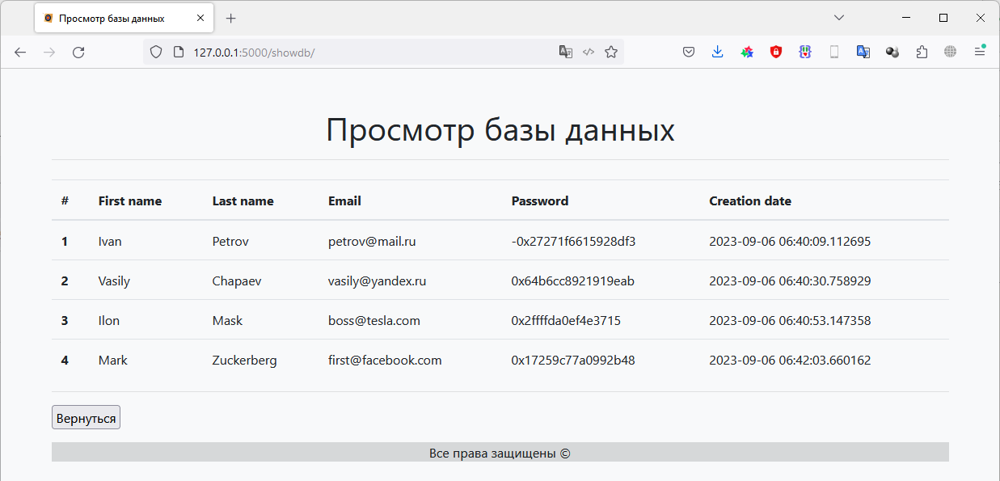

# Фреймворки Flask и FastAPI (семинары)
## Урок 3. Дополнительные возможности Flask

### Задание 1

Создать форму для регистрации пользователей на сайте. Форма должна содержать поля "Имя", "Фамилия", "Email", 
"Пароль" и кнопку "Зарегистрироваться". При отправке формы данные должны сохраняться в базе данных, 
а пароль должен быть зашифрован.

### Решение
**Задание 1**

### Результат работы:

Результат находится в файле main.py

Шифрование паролей выполнил через функцию *hash()*, и ее результат сохранил в базе данных.

Так же сделал возможным просмотр всей базы данных.
#### Главная страница

#### Страница "Подтверждение"

#### Страница "Просмотр базы данных"

